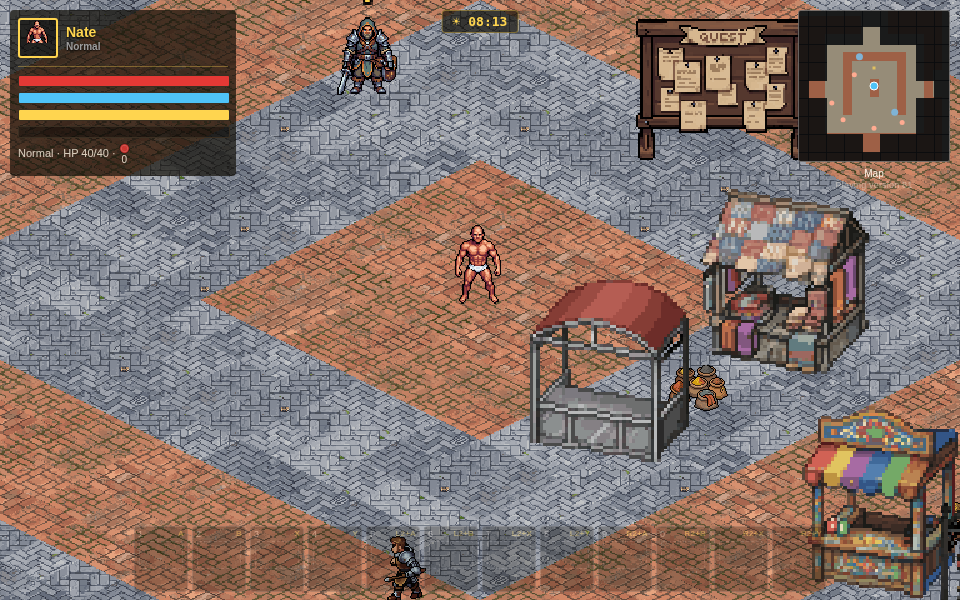
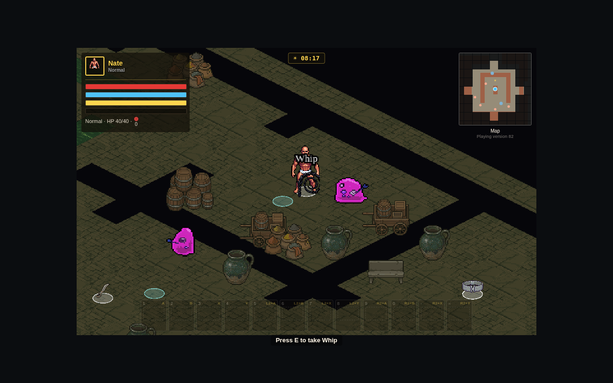
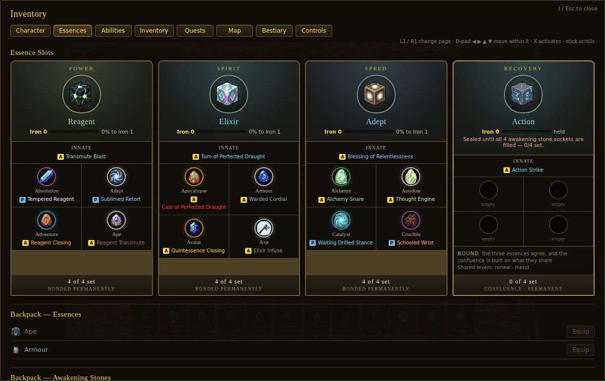
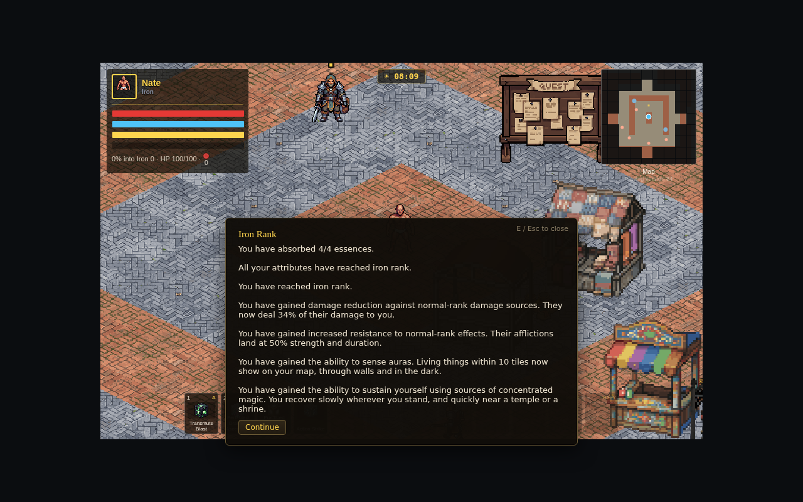
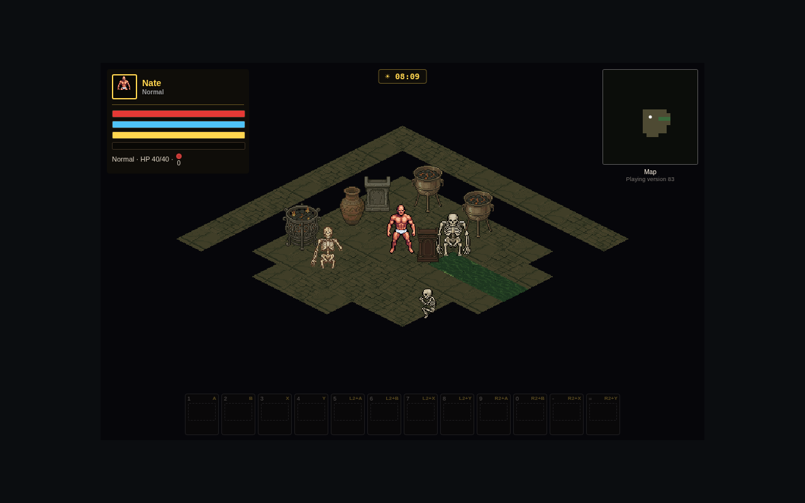
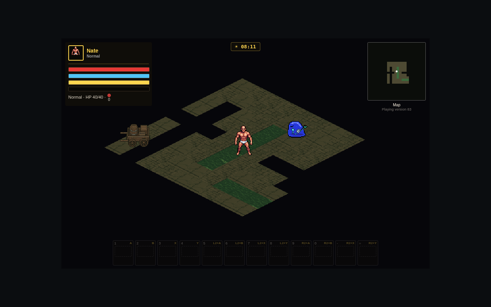

# Sparkstone

An isometric action-RPG set in Pallimustus, the world of *He Who Fights With
Monsters*. Four regions, a generated open world, and a character built out of
essences and awakening stones rather than out of a skill tree.

Runs in a browser. **Phaser 4.2.1**, vendored as a static file — no npm
install, no build step, no bundler. Everything else is plain ES modules.



---

## Running it

Serve the project root over http and open `index.html`:

```bash
python3 -m http.server 8000
# then open http://localhost:8000/index.html
```

Any static server works (`npx serve`, VS Code Live Server). The one
requirement is http(s) rather than a `file://` URL — ES module imports and the
asset loader both need it. On Linux, `Play Sparkstone.sh` starts a server and
opens a browser for you.

`deploy.sh` publishes the build to GitHub Pages.

---

## What is in it

| | |
|---|---|
| **World** | 4 regions of 1024×1024 tiles — The Nek, Ontaria, Elehyd, Bratugal |
| **Settlements** | 13, of which 4 are walled capitals; 53 interior districts and 8 house layouts |
| **Monsters** | **161** types across **31** families, each family in five shades |
| **Weapons** | **11** — 7 melee, 4 ranged |
| **Essences** | **148** |
| **Awakening stones** | **192** |
| **Gods** | 8, each with a public and a disciple quest track |
| **Companions** | 4, with authored arcs, banter and idle lines |
| **Audio** | 113 music and SFX files, on a per-bus mixer |
| **Loot** | drops on the floor — coins sweep in on their own, everything else is yours to take |
| **Quintessence** | 35 crafting materials, each named for a real essence and dropped by what the creature was made of |
| **Caves** | five layout families — cavern, chambers, gallery, ring, fissure — generated per site and never a rectangle |
| **Astral realms** | 4, one hidden behind each region, found only by aura sense — each holding a cult camp, 16 packs, 4 lone wanderers a rank above, and nodes a tier better than the region outside |
| **Crafting** | three benches, 15 stock rows out of the ground, 5 monster cores, and effects chosen by the quintessence you spend rather than rolled |
| **The auction house** | three blocks a day — 26 lots, 6 cores-and-quintessence, 7 gatherables-and-parts — rank-gated by the region it stands in, and it takes consignments |



### The essence system

This is the centre of the game, and it is generated rather than authored.

Bond **three essences** and a **confluence** forms on its own, lifting you from
Normal to Iron rank. Each of the four slots then takes up to **four awakening
stones** — **16 sockets** in total. Every socket generates a new ability themed
to that specific essence × stone pairing, until a full kit holds **20 distinct
abilities: 12 active and 8 passive** (auras, perception, a bonded familiar,
conjured weapon/armour/gear relics, and more).

Neither bond can be undone. An essence slot and its stones are permanent, which
is what makes the choice a choice.



### Combat and progression

- **Ranks** run Normal → Iron → Bronze → Silver → Gold. Rank comes from level
  floors and from per-essence standing, not from a quest. Reaching one is
  announced, and the announcement is true: at Iron a Normal-rank monster deals
  you 34% of its damage, its afflictions land at half strength, you sense the
  auras of living things ten tiles out through walls and dark, and you recover
  on ambient magic — six times faster beside a temple.

  
- **Meditate** in town (M) to bank 20% of your unbanked combat XP into real,
  rank-determining XP. Crossing a threshold plays the rank-up glow and then an
  ooze-drain that takes HP, mana and stamina to 1 — a breakthrough costs
  something.
- **Crits** are 1.5× at base; weapons, abilities and gear rolls all push your
  chance and multiplier.
- **Armour** cuts physical damage by a flat percentage, capping at 80%. It does
  nothing against elemental damage — that is what resistances are for. Martial
  abilities, the axe and the hammer **sunder** it.
- Wear a full set (helmet, chest, gloves, boots) and your character becomes the
  **armoured knight**, with 33 weapon/shield animation states painted in your
  equipment's own colours.

### Weapons

Listed by reach, with swing speed running the other way — a dagger is a fast
jab, a scythe is a slow enormous sweep.

| Weapon | Reach | Swing | Hands | Shape |
|---|---|---|---|---|
| Dagger | 30 | 0.12s | one | narrow stab, bleeds |
| Sword | 44 | 0.18s | one | half circle in front |
| Hammer | 54 | 0.30s | two | square in front, stuns |
| Axe | 64 | 0.32s | one | half circle in front |
| Spear | 82 | 0.26s | one | long narrow stab |
| Scythe | 96 | 0.42s | two | wide sweep |
| Whip | 120 | 0.20s | one | single target in a lane |
| Javelin | 200 | 0.24s | one | thrown |
| Staff | 240 | 0.18s | two | bolt |
| Bow | 260 | 0.20s | two | arrow |
| Crossbow | 300 | 0.34s | two | bolt |

The whip is the odd one out on purpose: the longest melee reach in the game at
sword speed, paid for by hitting exactly one enemy where the scythe hits
everything around you.

---

## Controls

### Keyboard and mouse

| | |
|---|---|
| Move | WASD / arrow keys |
| Attack | left-click (left hand) · right-click or Space (right hand) |
| Abilities 1–12 | `1 2 3 4 5 6 7 8 9 0 - =` |
| Interact / talk / doors | E |
| Inventory | I (Esc closes) |
| Sprint | Shift — 1.55× speed while it drains stamina |
| Meditate | M — town only |
| Character creator | C |
| Potions | `[` `]` `\` |
| Quick save | **F5** |
| Save menu | **F9** |

Movement is screen-relative: W always walks up the screen, even though the
world's grid renders as screen diagonals under this projection.

### Controller

| | |
|---|---|
| Move / sprint | left stick · L3 |
| Attack | L1 (left hand) · R1 (right hand) |
| Abilities | A B X Y · L2 + face · R2 + face |
| Interact | touchpad (D-pad up on pads without one) |
| Meditate | R3 |
| Inventory | Start |
| **In menus: change page** | **L1 / R1** |
| **In menus: move within a page** | **D-pad, all four directions** |
| In menus: activate | A or X |
| In menus: scroll | left stick |

The touchpad stays live while a menu is open, so you can always back out
without reaching for the keyboard.

---

## The inventory

Nine tabs: **Character**, **Essences**, **Abilities**, **Team**, **Inventory**,
**Quests**, **Map**, **Bestiary**, **Controls**.

The Bestiary is a browsable codex of every monster species you have actually
encountered, grouped by family, each with a portrait and lore rather than
numbers. The Map draws real terrain, with zoom in/out and a fit-to-region
reset. The Controls tab lists the current bindings for both input methods.

---

## Story and quests

The full picture — with counts, and an explicit split between what is authored
prose and what is generated — is in **[`STATUS_QUESTS_AND_STORY.md`](STATUS_QUESTS_AND_STORY.md)**.
In brief:

- **The prologue** is the opening: you wake in a sewer among the skeletons of a
  cult that reached too far, with no essences, no gear and no explanation.
  Follow the water and you are going the right way; every branch off that route
  is a dead end with something in it. You can see four tiles in any direction
  and remember, dimly, the corridors you have already walked — the minimap
  fills in as you go. Knowledge tells you what you need at the moment you need
  it, six times, and the last room has a survivor in it. 8–12 minutes, and you
  come up through a grate into Cadence carrying whatever you found. **Act 0**
  is the two-page cold open in front of it, and it is read from **inside** the
  sewer — you are already lying in the circle when Knowledge starts talking.
  Dying down there puts you back in the circle, not in a town you have not
  reached yet.

  

  

- **The Division chain** is the main story: 11 authored stages. **Acts 1 and 2
  walk end to end.** Acts 3 and 4 are not built.
- **The god quests** are 8 gods × 2 tracks × 4 chapters — **224 steps**, with 64
  hand-written chapter premises and generated objectives. Completable.
- **Companions** have 68 authored lines across four rank- and region-gated arcs.
- **Board quests** are generated from a per-week seed, so a board shows the same
  notices all week across saves.
- **The Adventure Society** is the contract ladder, and it is the answer to
  what was for six rounds the biggest known gap. Five ranks, three stars each,
  with authored premises and generated objectives. The mechanic worth knowing:
  **ranking up costs you a star.** Three stars at Normal becomes two at Iron,
  because you are now measured against Iron — the only number in the game that
  goes down, and it goes down for succeeding.

---

## Project layout

```
index.html              entry page; all UI chrome and CSS live here
src/main.js             Phaser config + boot (960×600 canvas)
src/scenes/WorldScene.js the game — world build, combat, UI, dialogue
src/data/               91 modules: the world, the catalogues, the generators
public/assets/          376 art files
public/audio/           113 music and SFX files
public/vendor/          the vendored Phaser build
tools/                  test runners and 111 browser test suites
tools/tests/            one suite per round, kept and re-run
extract_*.py            65 asset extractors, one per art drop
docs/                   lore reference, screenshots
```

The modules worth knowing first:

- **`src/data/awakening.js`** — the ability GENERATION system: the 101-name
  confluence list, the category taxonomy and name banks, candidate pools per
  essence × stone pairing, synergy-aware selection, the 12-active/8-passive
  budget steer, and the rare limit-breaker rolls. Carries a standing
  do-not-remove directive in its header.
- **`src/data/iso.js`** — the isometric projection, and the single source of
  truth for facing. Every building, monster and wall snaps through it.
- **`src/data/regions.js`** — the four regions, their settlements, rivers and
  ground packs.
- **`src/data/essenceCatalog.js`** / **`stoneCatalog.js`** — the 148 essences
  and 192 stones.
- **`src/data/division.js`** — Act 0 and the main story chain.
- **`src/data/sewer.js`** — the prologue: the maze as ASCII, Knowledge's six
  beats, the cultist, and the fault checks that hold the map to its promise.
- **`src/data/loot.js`** — what lies on the floor, how far it reaches, and the
  one switch that puts it in your bag.
- **`src/data/quintessence.js`** — the seven elemental flavours by five ranks,
  and which one a given monster leaves behind.
- **`src/data/rankBenefits.js`** — what a rank actually gives you, read by both
  the runtime and the message that announces it.
- **`src/data/godQuests.js`** — the eight gods and their chapters.
- **`src/data/budgets.js`** — the performance budgets, chiefly the display-list
  cap.
- **`src/data/crafting.js`** — the bench: stock, harvest nodes, monster cores,
  and the effect resolver, which owns no effect table of its own and asks
  `thematicDebuffsFor` the same question the ability generator asks.
- **`src/data/astral.js`** — the four realms, and what stands in them.
- **`src/data/auction.js`** — the auction's material blocks and the region gate
  on them, priced off the shop's own ladder rather than a second table.

### Testing

Three lanes, all headless Chromium against the running game:

```bash
bash tools/run_data.sh            # ~3s, pure-data checks
bash tools/run_one.sh <suite>     # one suite
bash tools/run_fast.sh <log>      # the full estate, sliceable
```

The full run is 99 suites and takes well over half an hour on two cores, so
`run_fast.sh` takes slice arguments (`run_fast.sh log 15 15`) and accumulates
results across calls.

The house rule for suites: **an assertion about a table is not an assertion
about the build.** Numbers are read off the world the scene actually
constructed, never off the data file that fed it.

The corollary, added in round 87: **assert the promise, not its symptoms.** Four
blobs that exist, animate and sit behind the content pass three checks and can
still be the wrong colour; unexplored ground can be correctly veiled in the
middle of the map and not at its edges. In both cases every check short of the
actual promise passed.

---

## Development

Work happens in numbered rounds. Each round has a notes file
(`ROUND91_NOTES.md` is the most recent) recording what was asked, what was
measured before and after, and what was left open. `HANDOFF.md` carries the
long-lived context.

Current version stamp: **91** — shown under the minimap in game, so you can
tell at a glance whether an update actually landed.
